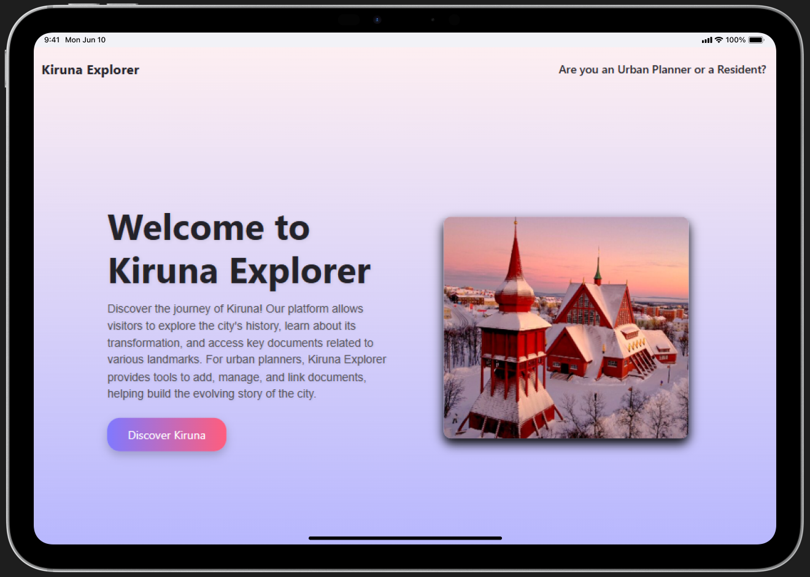
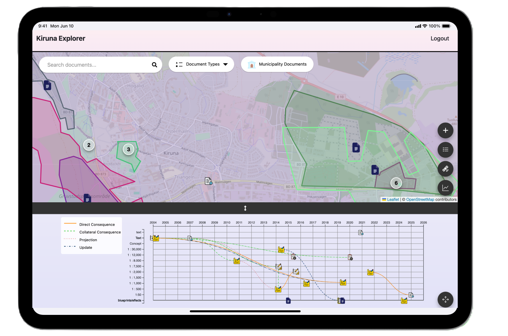

# 🌍 Kiruna eXplorer

The project is a web app featuring a **React frontend**, **Express backend**, **MongoDB**, and **Docker**. It follows an **Agile Scrum** framework with **bi-weekly demos**, **monthly releases**, **weekly retrospectives**, and task management through **YouTrack**. **SonarQube** ensures continuous code quality via automated checks.

  
  

&nbsp;

🎥 **Quick Presentation:**  
[Watch the Kiruna eXplorer video on YouTube](https://youtu.be/9GLxSt9epsI)

&nbsp;
## ✨ About Kiruna Explorer  

**Discover Kiruna's Journey!** Kiruna Explorer is an interactive web application that brings to life the rich history, cultural identity, and transformation of this unique city. As a flagship platform celebrating Kiruna's designation as **the European Capital of Culture 2029**, it serves as a bridge between past, present, and future.

Kiruna Explorer invites visitors to delve into the city’s remarkable story:  
- **Explore the History**: Learn about Kiruna’s origins and its relocation journey.  
- **Access Key Documents**: Navigate through detailed records tied to the city’s landmarks and transformation.  
- **Cultural Highlights**: Celebrate Kiruna’s artistic and architectural innovations.  

For urban planners, the platform offers powerful tools to:  
- Add, manage, and organize new resources.  
- Build connections between documents to shape the city's narrative.  

&nbsp;

## 🌲 **Branching Strategy**  

- **`main`**: Production-ready code with bi-weekly releases.  
- **`dev`**: Staging branch for testing all merged features before release.  
- **`feature/*`**: Temporary branches dedicated to specific tasks or features.  
 

&nbsp;

## 📂 **Project Documentation**

- **Backend**: The `backend` folder contains details about the server implementation (Express.js, MongoDB) and Docker configuration. It includes setup instructions, dependency management, and server runtime details.  
- **Client**: The `client` folder holds documentation for the React app, including guidance on starting the development server, managing dependencies, and customizing the user interface.  
- **Technical Dept**: The `TD_strategy.md` file tracks all Technical Debt items, including their prioritization and resolution status.  
- **Retrospectives**: The `Retrospective` folder contains notes and action items from our sprint retrospectives, used to improve processes and address recurring issues.  
- **Images**: The `Screenshots` folder stores images related to the project, such as demo screenshots.  
- **LICENSE**: The `LICENSE` file contains the licensing terms and conditions under which the project is distributed.  

Refer to these directories for all technical details needed to set up and run Kiruna Explorer. 

&nbsp;

## 📫 Contact  

Have questions, feedback, or want to contribute? Reach out to our team:  

- [Luca](https://github.com/dadoluca)  
- [Giada](https://github.com/Giada08)  
- [Moha](https://github.com/Mohammad-khataeii)  
- [Giancarlo](https://github.com/GiancarloVirga)  
- [Giacomo](https://github.com/giacomobelluardo)  
- [Bahar](https://github.com/baharmh71) 

